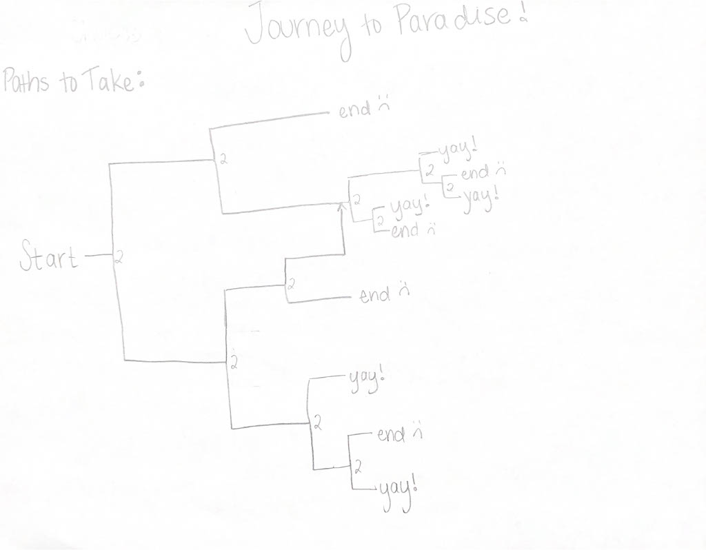
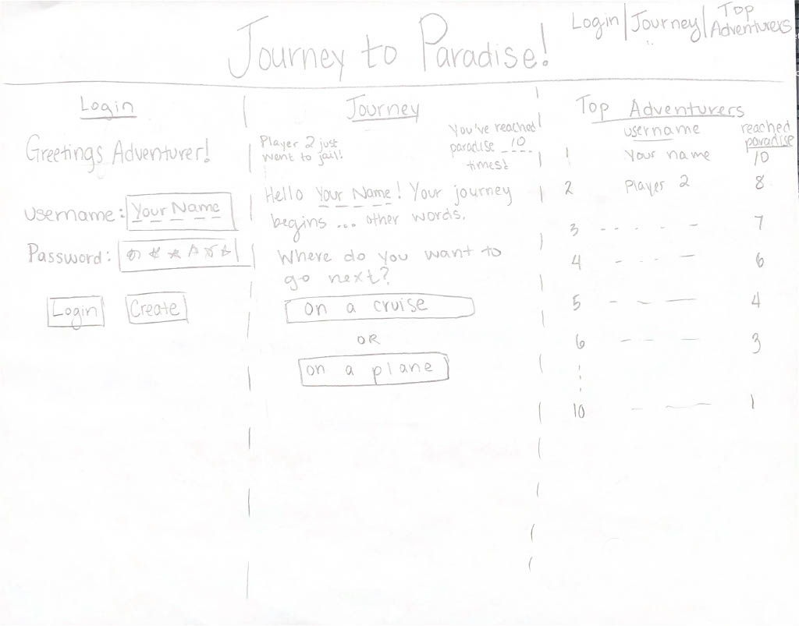

# Startup
Startup application for BYU CS 260

## Startup deliverable - specification
### Elevator Pitch 
Journey to Paradise! is a choose your own adventure game that leads to fun or travesty. Players start with two options on where to go and from there get to choose two more options and so on until they reach the end of their journey. Players might end up at Disneyland or Hawaii or be unlucky and end up in jail or worse!

### Design

### Key Features
- Secure login over HTTPS
- Start a new journey by choosing one of two options
- Two more options are given until the end is reached
- Number of times player has reached paradise is stored
- The screen lets you know when other players reach the end in realtime
- Players who have reached paradise the most times are displayed in a leaderboard

### Technologies
- **HTML** - Three HTML pages: one for login, one for the game, one for high scores
- **CSS** - Proper color contrast and whitespace so everything is easy to read and see. Sizing for different screens
- **JavaScript** - Login form, showing game, clicking on choice in game, seeing high scores and when others end game
- **Service** - Login, get high scores, and get your high score
- **Database/Login** - Save login information and amount of times reached paradise (high scores)
- **WebSocket**- Message appears when any player reaches the end of the game
- **React** - Use for the web framework

## HTML deliverable
- **HTML pages for each component of your application** - __ HTML pages: 1 to login, 1 to see top scores and realtime data, __ to choose your own adventure
- **Proper use of HTML tags including BODY, NAV, MAIN, HEADER, FOOTER** - nav, header, footer same for each page, main changed for each HTML page
- **Links between pages as necessary** - each page header can go login/start game/top scores, login leads to start of the game, game choice leads to HTML pages in adventure, end of game choose go start of game or top scores
- **Application textual content** - game gives description of where you are in your journey then lets you choose what you want to do next
- **Placeholder for 3rd party service calls** - weather on start HTML page
- **Application images** - Disneyland image on 1121 HTML page
- **Login placeholder, including user name display** - input box for username and password to submit or create account for login, username displayed on game pages
- **Database data placeholder showing content stored in the database** - player's number of times reached paradise saved and displayed, top players on top scores HTML page
- **WebSocket data placeholder showing where realtime communication will go** - realtime data of outcome of journey displayed on top scores HTML page